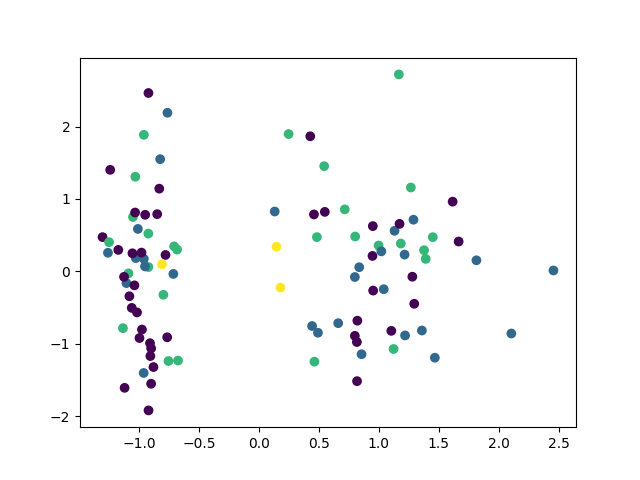
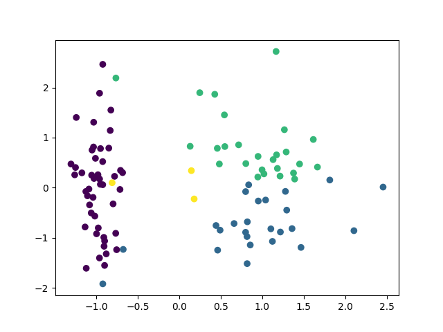
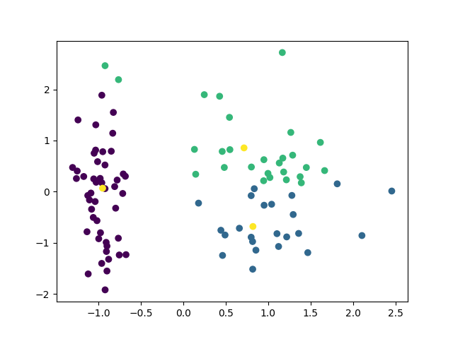
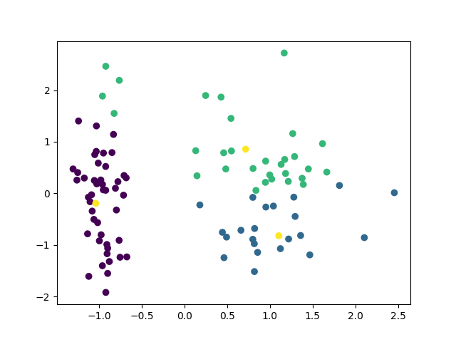

### Background
This repo implements algorithm 14.1 in Hastie, Tibshirani and Friedman, 2017

### How it works

We intialize randomly generated data with random assignments. Then we alterate:

1. Find the optimal centroids given the current assignment
2. Update the assignment given the new centroids

### Results

Initial random assignment

First iteration

Second iteration

Third iteration
